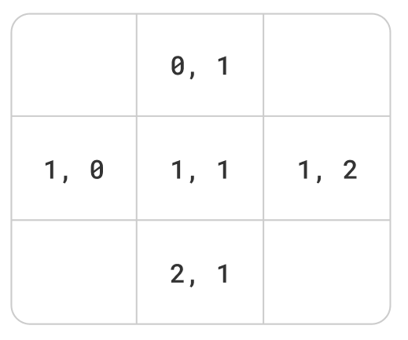

# 4-2-2. 방향배열

시작 좌표가 `1, 1` 일 때 동서남북은 다음과 같다.



- `y` 를 먼저 쓰는 습관을 들이자. `x, y` 형태의 문제도 제시되지만, 일단 `y` 를 먼저 쓴다고 고정해두고 생각하는게 좋다.

시작점에서 위로 갔다는 건, `y` 를 하나 줄였다는 뜻이다.  

시작점에서 오른쪽으로 갔다는 건, `x` 를 하나 늘렸다는 뜻이다.  

그래서, 이런 배열을 쌍으로 많이 활용한다.

```py
dy = [ -1, 1, 0, 0 ]
dx = [ 0, 0, -1, 1 ]
```

`i` 가 각각,

0 ⇒ -1, 0 ⇒ 상  

1 ⇒ 1, 0 ⇒ 하  

2 ⇒ 0, -1 ⇒ 좌  

3 ⇒ 0, 1 ⇒ 우  

이것을 아이디어로, 특정 좌표의 상하좌우 합을 구해보자.

다음을 `input.txt` 에 설정

```
4 4
1 3 7 2
2 2 6 1
1 4 5 1
1 1 2 1
1 1
``` 

`4 4` 는 맵 크기 N, M 을 의미한다.  
시작점이 `1 1` 로 주어졌을 때, 상하좌우의 합을 구하라.  

```py
import sys

# 파일입출력. 실제 시험에선 주석 처리 필요
sys.stdin = open("input.txt", "r")


class Point:
    def __init__(self, y, x):
        self.y = y
        self.x = x


# 방향배열
dy = [-1, 1, 0, 0]
dx = [0, 0, -1, 1]

# 입력
N, M = map(int, sys.stdin.readline().split())
board = [list(map(int, sys.stdin.readline().split())) for _ in range(N)]
sy, sx = map(int, sys.stdin.readline().split())

# 풀이
sp = Point(sy, sx)

sum_val = 0

for i in range(4):
    ny = sp.y + dy[i]
    nx = sp.x + dx[i]
    sum_val += board[ny][nx]

# 출력
print(sum_val)  # 15
```

- 단순히 `sy` , `sx` 로 적는 것보단, 위와 같이 좌표를 의미하는 `Point` 클래스를 정의하면 훨씬 가독성이 좋아진다. 지금은 별 것 아닐것같지만, 특정 함수에 파라미터로 넘겨줄때도 `y` , `x` 를 별도로 넘겨주는 것보단 훨씬 읽기 좋다.

그러나, 위 코드는 맵을 벗어나는 경우를 고려하지 않았다. 코딩 테스트에서 자주 사용되는, 다음 구문을 추가해주자.

```py
for i in range(4):
    ny = sp.y + dy[i]
    nx = sp.x + dx[i]
    # 맵을 벗어날 경우
    if ny < 0 or nx < 0 or ny >= N or nx >= M:
        continue
    sum_val += board[ny][nx]
```

맵을 벗어날 경우, 해당 방향은 합산에서 제외한다.

- `break` 가 아니라 `continue` 인 이유는 무엇일까? 위 상황에서 `break` 를 해버리면, 반복이 즉시 중단되어 맵을 벗어나지 않은 다른 값들까지 합산이 되지 않는다. 즉, 설령 지금 맵을 벗어났더라도 반복은 계속되어야 한다.