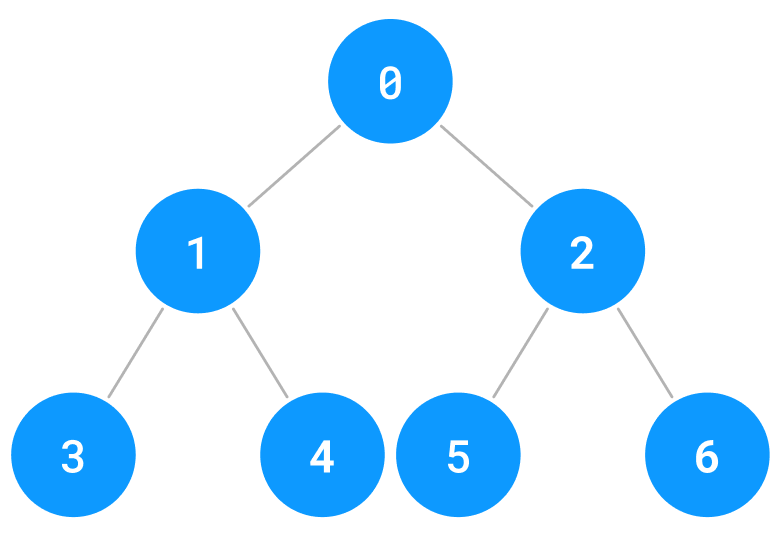

# 5-3-1. BFS 이해  

# 1. 인접행렬 (맵)  

BFS 는 한국어로 풀어서 설명하면 "너비 우선 탐색" 인데, 내가 갈 수 있는 곳을 먼저 들린다는 뜻이다.  

아랫쪽으로 향하는 DFS 는 재귀를 사용해서 전공자들도 어렵게 느끼기 때문에, 우리 수업에선 다루지 않는다.  

다음의 그래프를 보자.  

  

이런 식으로 방문한다.  

```
0 1 2 3 4 5 6
```

즉, 현재 노드에서 들릴 수 있는 형제 노드를 들린다.  

우선 틀을 작성해보자.  

```
7 7
0 1 1 0 0 0 0
1 0 0 1 1 0 0
1 0 0 0 0 1 1
0 1 0 0 0 0 0
0 1 0 0 0 0 0
0 0 1 0 0 0 0
0 0 1 0 0 0 0
```

```py
import sys
import queue

sys.stdin = open("input.txt", "r")

N, M = map(int, sys.stdin.readline().split())
board = [list(map(int, sys.stdin.readline().split())) for _ in range(N)]

visited = [False] * N


def bfs(st):
    pass


bfs(0)
```

구현을 위해, 큐 자료구조를 사용할 것이다.  

큐는 맨 뒤로 넣고, 맨 앞에서 뺀다.  


 위와 같은 방식으로 진행된다.  

이를 위해, 큐에서 제공하는 메서드를 알아야 한다.  

  `Queue.get` : 맨 앞에 있는 것 "꺼내기"    

  `Queue.put` : 맨 뒤에 추가  

  `Queue.empty` : 비어있는지 확인  

이를 기반으로 `bfs` 함수를 만들어보면,  

```py
def bfs(start):
    q = queue.Queue()  # FIFO 큐 사용
    visited[start] = True
    q.put(start)

    while not q.empty():
        current = q.get()  # 큐의 가장 앞의 정점을 꺼냄
        print(current, end=" ")
        for i in range(M):
            if not visited[i] and board[current][i] == 1:
                visited[i] = True
                q.put(i)
```

결과는?  

```
0 1 2 3 4 5 6
```

# 2. 인접리스트 (엣지)  

리스트에 `0` 이 너무 많아 비효율적이므로, 간선 정보 (엣지) 만 저장해보겠다.  

input 은 다음 형태로 들어온다.  

```
7 12
0 1
0 2
1 0
1 3
1 4
2 0
2 5
2 6
3 1
4 1
5 2
6 2
```

7: 노드 갯수  
12: 간선 갯수  
그리고, 각 노드가 연결된 정보가 입력되었다.  


그리고 이차원 리스트엔 다음과 같이 저장될 것이다.  

```
0 [1, 2]
1 [0, 3, 4]
2 [0, 5, 6]
3 [1]
4 [1]
5 [2]
6 [2]
```

이것으로 작성해 본 코드는 다음과 같다.  

```py
import sys
import queue

sys.stdin = open("input.txt", "r")

N, edge = map(int, sys.stdin.readline().split())
input_edges = [list(map(int, sys.stdin.readline().split())) for _ in range(edge)]

visited = [False] * N

v = [[] for _ in range(N)]
for a, b in input_edges:
    v[a].append(b)


def bfs(start):
    q = queue.Queue()  # FIFO 큐 사용
    visited[start] = True
    q.put(start)

    while not q.empty():
        now = q.get()
        print(now, end=" ")
        # ???


bfs(0)
```

`???` 부분을 바꿔보자.  

```py
# 현재 노드 now와 인접한 모든 노드를 확인
for next_node in v[now]:
    if visited[next_node]:
        continue
    visited[next_node] = True
    q.put(next_node)
```

