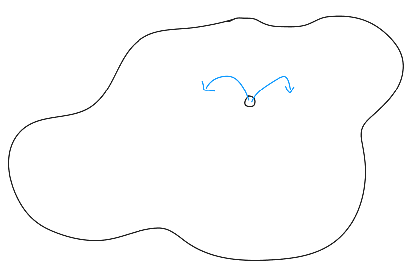

# 1-3. Flood Fill 의 이해와 구현

플러드필은 흘러넘쳐 채운다는 뜻이다.  

호수를 만든다 생각해보자. 땅에서 어떤 부분을 파면, 물이 나오면서 우물이 채워진다.  



시간이 얼마나 걸릴지 모르지만, 언젠가는 호수가 채워질 것이다.  

플러드필 역시 BFS 를 사용한다. 그래서 BFS 로 보아도 되지만, 다음 두 가지가 다르다.  

1. 상하좌우 네 방향으로 진행해야 한다. (문제에 따라선 꼭 그럴 필요가 없을 수도 있다.)  
2. 지금까진 단순히 노드로 판단했기 때문에 숫자를 집어넣는 게 가능했지만, 이젠 클래스를 큐 안에 집어넣어야 한다.  


이런 식으로, 큐가 빌 때까지 반복할 것이다.  

대신, 다음 상황에선 갈 수 없다.  

1. 맵 바깥을 벗어났을 때  
2. 이미 방문했을 때  

이를 기본으로, `4 X 4` 맵과 시작점 `{1, 1}` 이 주어졌을 때, 몇 번만에 우물이 채워지는지 확인해보는 코드를 작성해보자.  

```py
from collections import deque


class Point:
    def __init__(self, y, x):
        self.y = y
        self.x = x


# 방향배열
dy = [-1, 1, 0, 0]
dx = [0, 0, -1, 1]
board = [[0] * 4 for _ in range(4)]
visited = [[False] * 4 for _ in range(4)]


def bfs(st):
    q = deque()
    visited[st.y][st.x] = True
    q.append(st)

    while q:
        cp = q.popleft()
        for i in range(4):
            np = Point(cp.y + dy[i], cp.x + dx[i])
            if np.y < 0 or np.y >= 4 or np.x < 0 or np.x >= 4:
                continue
            if visited[np.y][np.x]:
                continue
            visited[np.y][np.x] = True
            q.append(np)


st = Point(1, 1)
bfs(st)
```

네 방향 가는 것, 맵 벗어나는 것, `visited` 체크를 잘 해주자.  

맨 처음과 진행시에 `visited` 가 갱신된 이후인 두 곳에 중단점을 걸고, 확인해보자.  

추가. 만약 도달하기까지의 거리를 일일이 체크하려면? `visited` 에 Boolean 대신, 거리를 넣으면 될 것.  

```py
from collections import deque


class Point:
    def __init__(self, y, x):
        self.y = y
        self.x = x


# 방향배열
dy = [-1, 1, 0, 0]
dx = [0, 0, -1, 1]
board = [[0] * 4 for _ in range(4)]
visited = [[0] * 4 for _ in range(4)]


def bfs(st):
    q = deque()
    visited[st.y][st.x] = 1
    q.append(st)

    while q:
        cp = q.popleft()
        for i in range(4):
            np = Point(cp.y + dy[i], cp.x + dx[i])
            if np.y < 0 or np.y >= 4 or np.x < 0 or np.x >= 4:
                continue
            if visited[np.y][np.x]:
                continue
            visited[np.y][np.x] = visited[cp.y][cp.x] + 1
            q.append(np)


st = Point(1, 1)
bfs(st)
```
