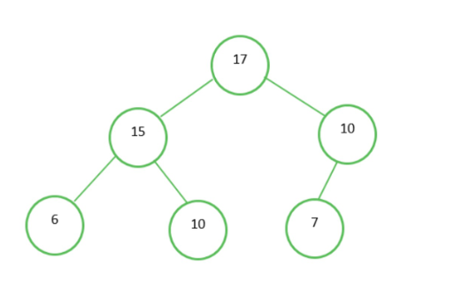

# 5-6-1. Heap Tree

어떤 데이터셋을 한번에 정렬하고 싶을 때와 같은 일반적인 정렬은 Quick Sort 를 사용하면 된다.  


그러나, 완성된 데이터셋이 아니라, 새로운 데이터가 계속 들어오며, 정렬된 상태를 "유지해야" 하는 상황이라면 Heap Sort (Priority Queue) 가 더 유리하다.  

다음과 같은 상황이다. 내림차순으로 유지해야 한다고 가정하자.  

```
17 15 10 10 7 6
```

이 상태에서 `11` 이 새로 추가된다면, 기존 Quick Sort 방식이라면 한번 더 `sort()` 함수를 호출해야 한다는 불편함이 있지만, Heap Sort 에 위 데이터셋이 입력되어있다면 그냥 `11` 을 집어넣기만 하면 된다.  


왜냐면, Heap Sort 는 다음과 같은 형태로 이루어져있기 때문이다.  




위 그림과 같은 트리를 Max Heap 이라고 한다.  
언뜻 보면, 하나도 정렬되어있지 않다. 루트만 최댓값일 뿐이며, 나머지 값은 모두 뒤죽박죽이다.  

Max Heap 은 다음과 같은 원칙을 가져야만 한다.  
1. 루트는 전체 노드에서 최댓값이어야만 한다.  
2. 모든 부모 노드는 자식 노드보단 크거나 같아야 한다.  

Max Heap Tree 에 `11` 이 들어오면 다음 규칙을 따른다.  
1. 맨 먼저, 마지막 노드에 `11` 을 삽입한다. 이 경우, `10` 아래이며, `7` 의 형제 노드가 된다.  
2. `11` 이 `10` 보단 크기에, 둘의 위치를 변경한다.  
3. `11` 은 `17` 보단 작기에, 여기서 변경을 멈춘다.  


만약, 맨 위에 있는 값 `top` 을 `pop` 한다면 무슨 일이 일어날까?  

1. `17` 이 빠지고, 맨 마지막 노드인 `7` 을 루트로 가져온다.  
2. `7` , `15` , `11` 중 새로운 루트를 결정한다. 이 경우, `15` 가 된다.  
3. `7` , `6` , `10` 중 새로운 부모를 결정한다. 이 경우, `10` 이다.  
4. `10` 아래에 `7` 과 `6` 이 존재하므로, 부모 노드가 자식 노드 두 개보다 같거나 크다. 즉, 새로운 Max Heap Tree 가 완성되었다.  


위 과정을 일일이 알 필요는 전혀 없다. 다만, Heap 자료구조는 데이터가 계속 추가되는데, 정렬된 상태로 유지되어야 할 때 `sort()` 보다 낫다는 점만 알면 된다.  

C++ 에서 Heap 은 Priority Queue (PQ) 의 내부 구현으로 사용되었다. 다음 장에서 살펴보자.  